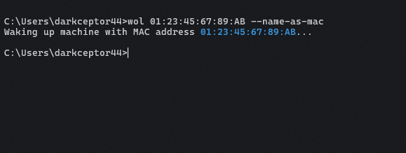

# wakeonlan-cli

A command-line application for sending Wake-on-LAN (WoL) magic packets over the network. It can be used to wake up a machine by its MAC address or by its alias, you can add machines through the CLI and save them to a config file, that way you don't have to memorize their MAC addresses.

## Installation

You can install the application from:

* Manually (after cloning the repo locally): `cargo install --path .`

## MSRV

The Minimum Supported Rust Version (MSRV) for `wakeonlan-cli` is **1.80**.

## Usage



```bash
$ wol --help
Wake-On-LAN command line interface for Rust

Usage: wol [OPTIONS] [NAME] [COMMAND]

Commands:
  add   Add machine to the config file
  help  Print this message or the help of the given subcommand(s)

Arguments:
  [NAME]  Name of the machine to wake up, if the `-n` option is specified then this is the MAC address to send the magic packet to (must be in format `xx:xx:xx:xx:xx:xx`)

Options:
  -n, --name-as-mac            This tells the CLI to use the name as the MAC address to send the magic packet to
  -b, --broadcast_addr <ADDR>  The broadcast address to send the magic packet to (must be `IP:PORT` format) [default: 255.255.255.255:9]    
  -h, --help                   Print help
  -V, --version                Print version
```

## Benchmarks

The CLI was benchmarked using [Hyperfine](https://github.com/sharkdp/hyperfine). The profiles used were:

* Release

```toml
[profile.release]
lto = true
codegen-units = 1
opt-level = 3
strip = true
```

* Fast

```toml
[profile.fast]
inherits = "release"
lto = false
```

### Windows

* AMD64, 32GB RAM, Ryzen 7 3800X, Windows 10

| Command | Mean [ms] | Min [ms] | Max [ms] | Relative |
| ------- | --------- | -------- | -------- | -------- |
| `wol 01:23:45:67:89:AB` ([swsnr/wol](https://crates.io/crates/wol) v0.3.1 + release) | 10.4 ± 3.1 | 8.9 | 47.8 | 1.00 |
| **`wol 01:23:45:67:89:AB -n` (v0.1.0 + release)** | 15.8 ± 1.4 | 14.4 | 29.3 | 1.53 ± 0.47 |
| **`wol 01:23:45:67:89:AB -n` (v0.1.0 + fast)** | 16.2 ± 1.9 | 14.6 | 27.6 | 1.56 ± 0.50 |

### Linux

* ARM64, 1GB RAM, Orange Pi Zero2, Debian 12

| Command | Mean [ms] | Min [ms] | Max [ms] | Relative |
| ------- | --------- | -------- | -------- | -------- |
| `wol 01:23:45:67:89:AB` ([swsnr/wol](https://crates.io/crates/wol) v0.3.1 + release) | 3.9 ± 0.2 | 3.6 | 4.5 | 1.00 |
| **`wol 01:23:45:67:89:AB -n` (v0.1.0 + release)** | 4.1 ± 0.2 | 3.7 | 4.8 | 1.06 ± 0.06 |
| **`wol 01:23:45:67:89:AB -n` (v0.1.0 + fast)** | 4.6 ± 0.3 | 4.2 | 9.0 | 1.17 ± 0.09 |
| `wakeonlan 01:23:45:67:89:AB` ([jpoliv/wakeonlan](https://github.com/jpoliv/wakeonlan) v0.41-12.1) | 93.0 ± 0.8 | 92.0 | 94.7 | 23.78 ± 1.04 |

## License

This project is licensed under the [GNU General Public License v3.0](https://www.gnu.org/licenses/gpl-3.0.en.html).
