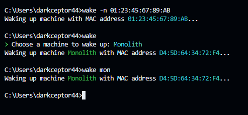

# waker-cli

A command-line application for sending Wake-on-LAN (WoL) magic packets over the network. It can be used to wake up a machine by its MAC address or by its alias, you can add machines through the CLI and save them to a config file, that way you don't have to memorize their MAC addresses.

## Installation

You can install the application from:

* [crates.io](https://crates.io/crates/waker-cli): `cargo install waker-cli`
* [GitHub](https://github.com/DarkCeptor44/waker): `cargo install --git https://github.com/DarkCeptor44/waker waker-cli`
* Manually (after cloning the repo locally): `cargo install --path .`

## MSRV

| Crate Version | MSRV |
| ----- | ---- |
| 1.0.x | 1.81 |
| 0.1.x | 1.80 |

## Usage



```bash
$ wake --help
Wake-On-LAN command line interface for Rust

Usage: wake [OPTIONS] [NAME] [COMMAND]

Commands:
  add     Add machine
  edit    Edit machine
  list    List machines
  remove  Remove one or multiple machine
  help    Print this message or the help of the given subcommand(s)

Arguments:
  [NAME]  Name of the machine to wake up, if the `-n` option is specified then this is the MAC address to send the magic packet to (must be in format `xx:xx:xx:xx:xx:xx`)

Options:
  -n, --name-as-mac              This tells the CLI to use the name as the MAC address to send the magic packet to
  -b, --bcast-addr <BCAST_ADDR>  The broadcast address to send the magic packet to (must be `IP:PORT` format) [default: 255.255.255.255:9]  
  -B, --bind-addr <BIND_ADDR>    The address to bind the UDP socket to (must be `IP:PORT` format) [default: 0.0.0.0:0]
  -h, --help                     Print help
  -V, --version                  Print version
```

## Benchmarks

The CLI was benchmarked using [Hyperfine](https://github.com/sharkdp/hyperfine). The profiles used were:

* Release

```toml
[profile.release]
lto = true
codegen-units = 1
opt-level = 3
strip = true
```

* Fast

```toml
[profile.fast]
inherits = "release"
lto = false
```

### Windows

* AMD64, 32GB RAM, Ryzen 7 3800X, Windows 10

| Command | Mean [ms] | Min [ms] | Max [ms] | Relative |
| ------- | --------- | -------- | -------- | -------- |
| `wol 01:23:45:67:89:AB` ([swsnr/wol](https://crates.io/crates/wol) v0.3.1 + release) | 10.3 ± 0.7 | 9.1 | 13.0 | 1.00 |
| `wol-rs 01:23:45:67:89:AB` ([fengyc/wol-rs](https://crates.io/crates/wol-rs) v1.1.0 + release) | 10.8 ± 1.5 | 9.5 | 27.9 | 1.05 ± 0.16 |
| `wake -n 01:23:45:67:89:AB` (v0.1.0 + fast) | 16.3 ± 0.9 | 14.7 | 21.0 | 1.57 ± 0.13 |
| `wake -n 01:23:45:67:89:AB` (v0.1.0 + release) | 16.3 ± 1.3 | 14.5 | 22.9 | 1.58 ± 0.16 |

### Linux

* ARM64, 1GB RAM, Orange Pi Zero2, Debian 12

| Command | Mean [ms] | Min [ms] | Max [ms] | Relative |
| ------- | --------- | -------- | -------- | -------- |
| `wol 01:23:45:67:89:AB` ([swsnr/wol](https://crates.io/crates/wol) v0.3.1 + release) | 2.3 ± 0.2 | 2.0 | 3.5 | 1.00 |
| `wake -n 01:23:45:67:89:AB` (v0.1.0 + release) | 2.6 ± 0.2 | 2.2 | 3.3 | 1.12 ± 0.12 |
| `wake -n 01:23:45:67:89:AB` (v0.1.0 + fast) | 3.0 ± 0.2 | 2.6 | 4.5 | 1.30 ± 0.14 |
| `wol-rs 01:23:45:67:89:AB` ([fengyc/wol-rs](https://crates.io/crates/wol-rs) v1.1.0 + release) | 3.5 ± 0.2 | 3.2 | 4.2 | 1.55 ± 0.15 |
| `wakeonlan 01:23:45:67:89:AB` ([jpoliv/wakeonlan](https://github.com/jpoliv/wakeonlan) v0.41-12.1) | 92.2 ± 6.0 | 89.9 | 124.2 | 40.31 ± 4.26 |

## License

This project is licensed under the [GNU General Public License v3.0](https://www.gnu.org/licenses/gpl-3.0.en.html).
